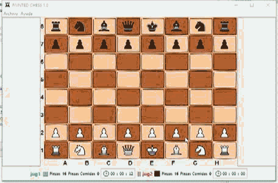
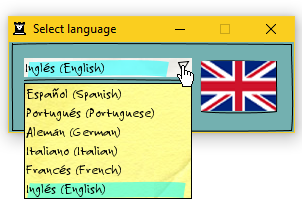
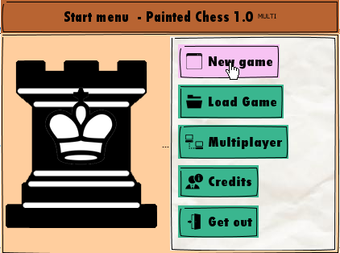
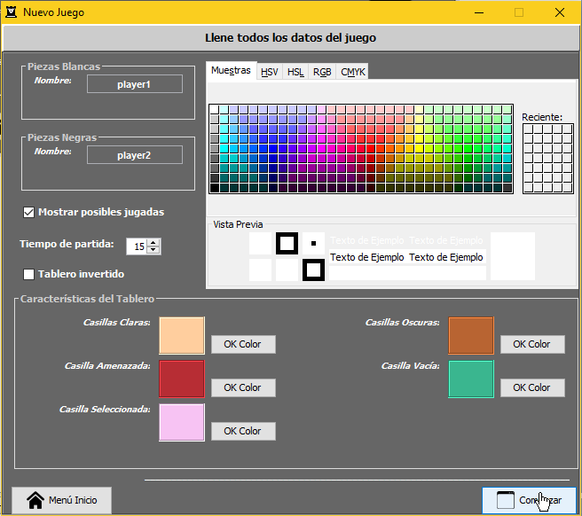
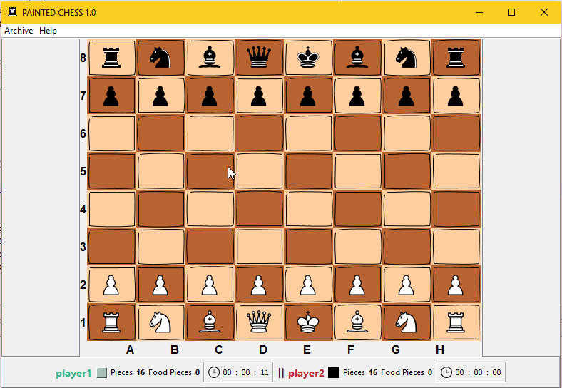
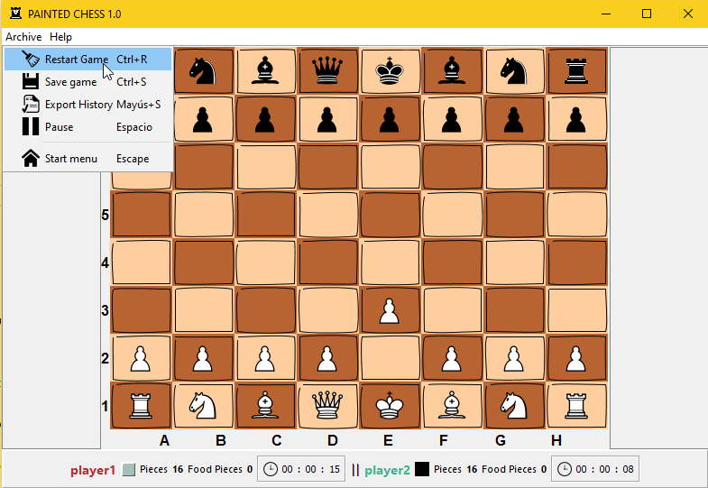
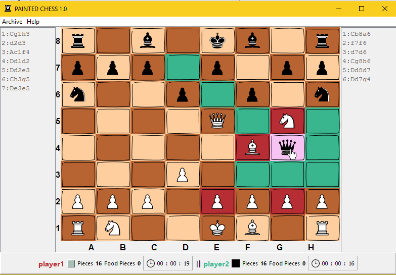
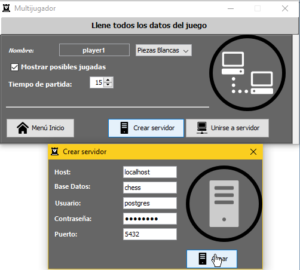

# Painted Chess Game

====

## 

### A simple chess game built in java 6

## Table of topics
1. [Requirements](#req)
1. [About the game](#about)
    - [Lang selection](#lang-select)
    - [Main window](#main-win)
    - [New game window](#new-game-win)
    - [Game area](#game-area)
    - [Muliplayer area](#multiplayer-area)
1. [New versions of this tool](#changelog)
1. [Further help](#help)

<h2 id="req">Requirements</h2>

- **jdk version:** 1.6.0_38 _(or above)_
- **preferred SO:** Microsoft Windows 7 (or above)

<h2 id="about">About the game</h2>

The game flow starts with the lang selection window where you can choose yours

**<h3 id="lang-select">Lang selection</h3>**

This window has a droppable list with six possible langs to choose from. Also it shows you the corresponding flag for each of them:

## 

The flow continues with the main window

**<h3 id="main-win">Main window</h3>**
This window has five buttons such as:

- New game
- Load Game
- Multiplayer
- Credits
- Get Out

## 

1. If we click on the first button we will go to the **New game settings** window

1. If we click on the second button it will prompt a dialog for loading a saved game match. When a game match is saved it will be automatically saved in *Documents/Painted Chess - Data/Saves/*

1. If we click on the third button we will go to the **Multiplayer** area

1. If we click on the fourth button we will see a new window with the game's contributors and its creator

1. Lastly if we click in the last button the game will shut down

**<h3 id="new-game-win">New game window</h3>**

## 
In this window is needed to specify the both players names. Is optional to customize the board cells colors, the match time and other features. When all are set click on **start** button.

Then you will go to new window. This new window is the game runnning area

**<h3 id="game-area">Game area</h3>**
This is the area when the game is played for both players. 

## 

It has a menu bar with multiple options such as:

- Restart current game
- Save current game
- Pause current game
- Go to the main menu window
- About us info
- Game online documentation

## 

It is compound by four panels one in the middle for the board, two others in the sides for displaying plays history and the last one in the bottom displaying players stats.

## 

**<h3 id="multiplayer-area">Multiplayer area</h3>**
Here is all the needed configuration for connecting two PC and play the game. In the first window the user need to type his name, pieces color, match time and choose between *join* or *create* a server. For each option it is needed to specify the correcto database information. (By default Painted-Chess has a postgreSQL plugin connection)
  
## 

## &nbsp;
## That's all the basics, hope you enjoy the game!
-----------------

## Changelog

Get update with all new versions [here](https://github.com/2rhop/painted-chess/releases)

## Licence
Copyright (c) 2019 Rene Ricardo. Licensed under the [MIT](https://github.com/2rhop/painted-chess/blob/master/LICENSE) license.

## Help

Send me an [email](mailto:renerp2016@gmail.com) if you have some doubt or just add an [issue](https://github.com/2rhop/painted-chess/issues)